# ***SEDHOM Display OS***  
 &emsp;

 &emsp;
 &emsp;

 &emsp;


# 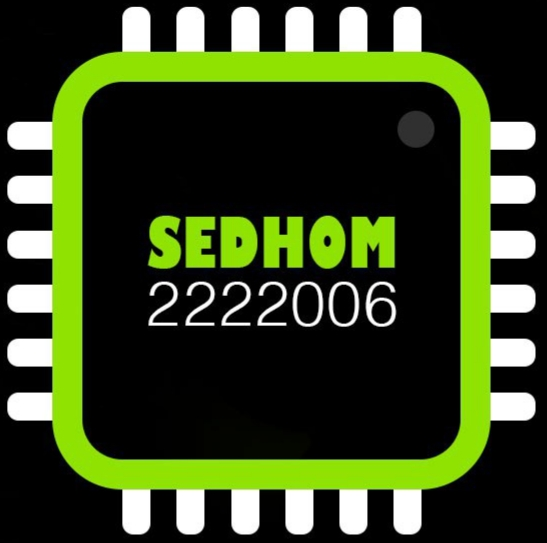 ***SEDHOM Company***

by ***Eng.Mustafa Sedhom*** Embedded Software and Hardware Engineer


#
## **about library**

### I draw all icons and widgets and pages by using circles & rectangles and triangles only i dont use any images or bitmap images this way make this library take small size .
### you can use this lib in 
- ### &emsp; Arduino IDE 
- ### &emsp; Platform IO

is new version of my Library you can use any tft display and you can install it in arduino ide , platform io or you are embeeded engineer .
you can see most project i made with this library and arduino uno and tft 3.5 inch sheild as apicture and videos look this link in my Google Drive : &ensp; [SEDHOM Display OS Videos and photos](https://drive.google.com/drive/folders/1wHmT84Y8fNRLakDVIZ7PI9R9al82iIt8?usp=sharing)


#
## **about this version**
- **last version :** &emsp; 
- adding some widgets and icons .
- adding effect like BLUR effect .
- handling all file for this lib and make it for begineers to use it .
- in SEDHOM_Display_OS.h class that has 4 var .
#
## **why I made this lib ?**
- this lib i use it for drawing some icons in ant tft i use it with arduino uno and nano and mega and esp32 .
- this lib doing any thing about this tft touch display with any mcu like sd card read file touch draw any thing in this tft display .
- GUI simple for control GPIO and smart thing .
- simple use for beginner to use elcronics .
#
## **what this lib do ?**
- draw some icons and wedigts and handling touch and read file from sd card .
- handling pages it's you make it .
- drawing pages i make it for any thing .
- you can make Beuatiful GUI for any machine and smart homes .
#
## **about Writer this Library**

***Eng.Mustafa Sedhom*** ( Embedded Software and Haedware Engineer ) 

  Gmail : **elmohandes24680@gmail.com**

  FaceBook Page : **[Mustafa Sedhom](https://www.facebook.com/share/1AHF9akrtB/)**

  linkedIn : **[Mustafa Sedhom](https://www.linkedin.com/in/mustafa-sedhom-bb2551322)**

  WhatsApp : **+201144962908**
#
## **properites of Library**
- OS
    ```cpp
    void Init_Screen(ROTATION_STATUS_t Rotate = Rotate_90_Degree,Color_t Mode = Night_Mode);
    void Set_Device_Mode(Color_t Mode = Night_Mode);
    int Screen_Height();
    int Screen_Width();
    Color_t Mode();
    Color_t Not_Mode();
    void Fill_Screen(Color_t color = Night_Mode);
    int Convert_Coordinates_to_Center_X_Point(int x);
    int Convert_Coordinates_to_Center_Y_Point(int y);
    Coordinate_t Convert_Coordinates_to_Center(Coordinate_t new_point);
    Color_t Night_mode = Night_Mode ;
    Color_t Light_mode = Light_Mode ;
    ROTATION_STATUS_t Rotate_0 = Rotate_0_Degree;
    ROTATION_STATUS_t Rotate_90 = Rotate_90_Degree;
    ROTATION_STATUS_t Rotate_180 = Rotate_180_Degree;
    ROTATION_STATUS_t Rotate_270 = Rotate_270_Degree;

    ```
- Data Structure
    ```cpp
    Stack<Data Type> stack ;
    Queue<Data Type> queue ;
    LinkedList<Data Type> linkedlist = new LinkedList<Data Type>() ;

    ```
- Shapes
    ```cpp
        // define Basic shapes
        void Pixel(Pixel_t pixel);
        void Line(Line_t line);    
        void Rectangle(Rectangle_t rect);
        void Square(Square_t sqrt);  
        void Circle(Circle_t circle); 
        void Triangle(Triangle_t tri); 
        void Equilateral_Triangle(Triangle_special_t tri);
        void Right_Triangle(Icon_t Icon,Area_t area,Shape_filled_t filled);
        void Border_Rectangle(Icon_t Border_Rect,Area_t area,int Radius,int Border_size);
        void Container(Rectangle_t container);
        // custom image or font
        void Draw_Custom_int_shape(Icon_t Icon,Area_t area,int arr[]);
        void Draw_Custom_Char(Icon_t Icon,Area_t area,char arr[]);

    ```
- Icons 
    ```Cpp
        #define default_parameter_for_icon  {{150,80},Magenta,Black}
        #define default_parameter_for_text  {FONT_BIG,Blue,"Text"}
        // to set and handling mode
        void Set_Mode(Color_t Mode){mode = Mode;}
        // Draw SEDHOM Icons
        void WIFI_Icon(Icon_t Icon = default_parameter_for_icon ,Color_t color_off = DarkGrey,WIFI_STATUS_t state = WIFI_Status_connected_level_4_full);
        void Battery_Icon(Icon_t Icon = default_parameter_for_icon  ,int range = 50 ,Color_t txt_color = White ,bool low_charge_red_color = true);
        void Home_Icon(Icon_t Icon = default_parameter_for_icon);
        void Setting_Icon(Icon_t Icon = default_parameter_for_icon);
        void Add_Icon(Icon_t Icon = default_parameter_for_icon);
        void SD_Card_Icon(Icon_t Icon = default_parameter_for_icon);
        void Control_Icon(Icon_t Icon = default_parameter_for_icon);
        void Sensor_Icon(Icon_t Icon = default_parameter_for_icon);
        void Power_off_Icon(Icon_t Icon = default_parameter_for_icon);
        void Bluetooth_Icon(Icon_t Icon = default_parameter_for_icon ,BLUETOOTH_STATUS_t connect_status = BLuetooth_Status_open_and_connected);
        void Button_Icon(Icon_t Icon = default_parameter_for_icon,bool print_on_and_off = 0);
        void Display_Time_Icon(Icon_t Icon = default_parameter_for_icon , Time_t time = {5,13,42,"AM"});
        void Terminal_Icon(Icon_t Icon = default_parameter_for_icon);
        void About_Icon(Icon_t Icon = default_parameter_for_icon);
        void Display_Date_Icon(Icon_t Icon =default_parameter_for_icon,Date_t Date = {2026,2,16,"Feb","Mon"},Color_t Text_color = BLUE);
        void Arrow_Icon(Icon_t Icon = default_parameter_for_icon,Direction_t Dir = Direction_Right,Color_t border_color = -1);
        void Color_Icon(Icon_t Icon = default_parameter_for_icon);
        void Time_Icon(Icon_t Icon = default_parameter_for_icon);
        void Date_Icon(Icon_t Icon = default_parameter_for_icon);
        void Switch_Icon(Icon_t Icon = default_parameter_for_icon,Color_t color_off = RED,Color_t thumb_color = WHITE,Color_t txt_color = WHITE,SWITCH_STATUS_t state = SWITCH_State_ON);
        void label_Icon(Icon_t Icon = default_parameter_for_icon ,Area_t area = {100,50},int Border = 3,Color_t color_str_in_label = Magenta,String string_in_label = "Label");
        void slider_Icon(Icon_t Icon = default_parameter_for_icon,int h = 200,byte_t range =50 ,Color_t color_not_active = Color_DarkGrey ,Color_t ball_color = WHITE,Color_t box_color = RED,Color_t range_in_box_color = BLUE);
        void file_Icon(Icon_t Icon = default_parameter_for_icon,Color_t Border_color = RED,Color_t file_extend_color = Color_Blue,String file_extend = "txt");
        void folder_Icon(Icon_t Icon = default_parameter_for_icon);
        void Divider(Icon_t Icon = default_parameter_for_icon,Orientation_t orientation = VERTICAL,int length = 50,int thickness = 5);
        void ID_Card_Icon(Icon_t Icon = default_parameter_for_icon, User_ID_Data_t User = {} ,Color_t main_font_color = RED,Color_t font_color = Blue);
        void Joy_Stick_Icon(Icon_t Icon = default_parameter_for_icon ,Coordinate_t thumb = {150,80} ,int thumb_size = 15,Color_t Border_color = BLUE,Color_t thumb_color = white,Color_t Color_inside_arrow = BLACK);
        void Temperature_Meter_Icon(Icon_t Icon = default_parameter_for_icon,Color_t Border = WHITE,int value = 50,bool show_val_dashes = true);
        void Tone_Icon(Icon_t Icon = default_parameter_for_icon,bool is_muted_or_not = false);
        void Sound_value_Icon(Icon_t Icon = default_parameter_for_icon,int value = 50,Color_t thickness_color = GREEN,bool thickness_or_not = false);
        void Video_Icon(Icon_t Icon = default_parameter_for_icon);
        void Block_Icon(Icon_t Icon = default_parameter_for_icon,bool open_or_closed = false);
        void Signal_Icon(Icon_t Icon = default_parameter_for_icon,SIGNAL_STATUS_t state = Signal_Status_Signal_level_3,Color_t color_off = DarkGrey);
        void Bell_Icon(Icon_t Icon = default_parameter_for_icon,bool mute_or_not = false,bool filled_or_not = true);
        void Menu_Icon_1(Icon_t Icon = default_parameter_for_icon); // : : :
        void Menu_Icon_2(Icon_t Icon = default_parameter_for_icon); // ...
        void Menu_Icon_3(Icon_t Icon = default_parameter_for_icon); // :
        void Menu_Icon_4(Icon_t Icon = default_parameter_for_icon); // : :
        void Menu_Icon_5(Icon_t Icon = default_parameter_for_icon); // = 
        void Moon_Icon(Icon_t Icon = default_parameter_for_icon);
        void Sun_Icon(Icon_t Icon = default_parameter_for_icon);
        void Check_Box_Icon(Icon_t Icon = default_parameter_for_icon,bool status = true,Color_t check_color = GREEN,Color_t checked_fill_color = Black);
        void Radio_Button_Icon(Icon_t Icon = default_parameter_for_icon,bool status = true,Color_t check_color = Green);
        void Text_Feild_Icon(  Icon_t Icon = default_parameter_for_icon,Text_t Text = {} ,int length = 200,int max_char = 10);
        void Warning_Icon( Icon_t Icon = default_parameter_for_icon,Color_t txt_color = RED,Shape_filled_t filled = Shape_Draw );
        void Chandelier_Icon(Icon_t Icon = default_parameter_for_icon);
        void Smart_TV_Icon(Icon_t Icon = default_parameter_for_icon,Color_t WIFI_icon = White);
        void Air_Conditioner_Icon(Icon_t Icon = default_parameter_for_icon);

    ```
- Text 
    ```cpp
        static void Text_C(Coordinate_t coordinate,const GFXfont* font,Color_t color,string_t txt);
        void Text(Coordinate_t coordinate,const GFXfont* font,Color_t color,String str);
        void Text(Coordinate_t coordinate,Text_t str);
        void Text(Coordinate_t coordinate,const GFXfont* font,Color_t color,float value);
        void Text(Coordinate_t coordinate,const GFXfont* font,Color_t color,int value);

    ```
- Fonts 
    ```cpp
    // Default small and Big Font                 
     FONT_SMALL                
     FONT_BIG                  
    // SevenSegment
     FONT_SEVENSEGMENT         
    // FreeSans
     FONT_FREESANS_SMALL       
     FONT_FREESANS_MEDIUM      
     FONT_FREESANS_BIG         
     FONT_FREESANS_VERYBIG     
    // FreeSansBold
     FONT_FREESANSBOLD_SMALL       
     FONT_FREESANSBOLD_MEDIUM      
     FONT_FREESANSBOLD_BIG         
     FONT_FREESANSBOLD_VERYBIG     
    // FreeSansOblique
     FONT_FREESANSOBLIQUE_SMALL       
     FONT_FREESANSOBLIQUE_MEDIUM      
     FONT_FREESANSOBLIQUE_BIG         
     FONT_FREESANSOBLIQUE_VERYBIG     
    // FreeSerif
     FONT_FREESERIF_SMALL       
     FONT_FREESERIF_MEDIUM      
     FONT_FREESERIF_BIG         
     FONT_FREESERIF_VERYBIG     
    // FreeSerifBold
     FONT_FREESERIFBOLD_SMALL       
     FONT_FREESERIFBOLD_MEDIUM      
     FONT_FREESERIFBOLD_BIG         
     FONT_FREESERIFBOLD_VERYBIG     
    // FreeSerifItalic
     FONT_FREESERIFITALIC_SMALL       
     FONT_FREESERIFITALIC_MEDIUM      
     FONT_FREESERIFITALIC_BIG         
     FONT_FREESERIFITALIC_VERYBIG     
    // FreeSerifBoldItalic
     FONT_FREESERIFBOLDITALIC_SMALL       
     FONT_FREESERIFBOLDITALIC_MEDIUM      
     FONT_FREESERIFBOLDITALIC_BIG         
     FONT_FREESERIFBOLDITALIC_VERYBIG     
    // FreeMono
     FONT_FREEMONO_SMALL       
     FONT_FREEMONO_MEDIUM      
     FONT_FREEMONO_BIG         
     FONT_FREEMONO_VERYBIG     
    // FreeMonoBold
     FONT_FREEMONOBOLD_SMALL       
     FONT_FREEMONOBOLD_MEDIUM      
     FONT_FREEMONOBOLD_BIG         
     FONT_FREEMONOBOLD_VERYBIG     
    // FreeMonoOblique
     FONT_FREEMONOOBLIQUE_SMALL       
     FONT_FREEMONOOBLIQUE_MEDIUM      
     FONT_FREEMONOOBLIQUE_BIG         
     FONT_FREEMONOOBLIQUE_VERYBIG     
    // FreeMonoBoldOblique
     FONT_FREEMONOBOLDOBLIQUE_SMALL       
     FONT_FREEMONOBOLDOBLIQUE_MEDIUM      
     FONT_FREEMONOBOLDOBLIQUE_BIG         
     FONT_FREEMONOBOLDOBLIQUE_VERYBIG     

    ```
- Widgets
    ```cpp
    void set_widgets_mode(Color_t mode = Color_Black);
    void APP_Bar_Widget(bool show_back_arrow = true,WIFI_STATUS_t WIFI_state = WIFI_Status_connected_level_2_half,BLUETOOTH_STATUS_t Bluetooth_state = BLuetooth_Status_open_and_not_connected,int Battery_Value = 22,Time_t time = {12,33,17,"Am"},Color_t Wifi_on = Color_Blue,Color_t Wifi_off= Color_DarkGrey,Color_t BLE_color= Color_Yellow,Color_t Battery_color = Color_Green,Color_t Time_color = Color_Magenta,Color_t Reverse_color = Color_Blue,Color_t Background=Color_Black);
    void Big_frame_widget(Color_t color = Color_White,Color_t Background = Color_Black);
    void ERROR_Massage_Widget(String massage = "SEDHOM Display OS Error",Color_t Background = Color_Black,Color_t color=MAGENTA,Color_t color_txt=WHITE,Color_t ERROR_Massage_color = RED,Color_t title_Massage_color = BLUE,String title="ERROR",Shape_filled_t filled = Shape_Fill,int x = 100,int y = 70,int w = 240,int h = 160,int max_lines_of_massage_error =5,int max_char_in_one_line = 20);
    void Drawer_Widget(String Drawer_name = "Drawer",bool show_exit_icon = true,Color_t Drawer_color = Color_Magenta,Color_t Drawer_border_color = Color_White,Color_t Drawer_name_color = Color_White,Color_t exit_button_color = Color_Red);
    void Delete_Drawer_Widget();
    void Handle_Drawer_Widget(Icon_t Icon_menu = {{30,90},Color_Blue,Color_Black},int menu_icon_number = 5,String Drawer_name = "Drawer",bool show_exit_icon = true,Color_t Drawer_color = Color_Magenta,Color_t Drawer_border_color = Color_White,Color_t Drawer_name_color = Color_White,Color_t exit_button_color = Color_Red);


    ```
- Windows
    ```cpp
     void set_windows_mode(Color_t mode);
      String Full_KeyBoard_window_user_input_TXT = "";
      //drawing window functions 
      void Full_Key_Board_Window(Color_t color,Color_t Background,Color_t char_color = WHITE,Color_t text_field_color = -1,bool caps_or_not=true,bool special_char_or_not=false);
      <!-- bool Handling_Touch_Full_Key_Board_Window(); -->

    ```
- Touch
    ``` Cpp
      bool Is_Pressed();
      int get_X_point();
      int get_Y_point();
      int get_Z_point();
      bool onTap(Touch_t pressed_space);
      void onTap(Touch_t pressed_space,void (*Do_Function)());
    ```
- SD Card 
    ```cpp
    read();
    write();
    open();
    close();
    ...
    ```
- Handle pages
    ```cpp
      // input SEDHOM_Handling_pages_parameters instead of void (*pages_array[])(void), int size
      void Handle_all_pages(void (*pages_array[])(void), int size);
      void goto_page(int number);
      void push_page();
      void pop_page();
    ```
- Time
    ```cpp
    void Stop_Display(int time);
    void Wait(int time);
    unsigned long Calc_time_ms();
    unsigned long Calc_time_us();

    ```
- Effects
    ```cpp
        // effects 
        Color_t Blur(Icon_t Icon,Area_t area,int r,int Blur_value,Shapes_t shape = Shape_Rectangle);
        Color_t Color_Blur(Icon_t Icon,Area_t area,int r,int Blur_value,Shapes_t shape = Shape_Rectangle);
        Color_t Shadow_effect(Icon_t shadow = {} , Shapes_t shape = Shape_Rectangle, int shadow_size = 5 , int shadow_h = 120 , int shadow_w = 200 ,int shadow_Radius = 20 , Position_t pos = Position_Right_and_Bottom, Color_t Shadow_color = Color_DarkGrey);

    ```
- Animation
    ```cpp
        void Change_Text_Color(Coordinate_t co, GFXfont* Font,int Animation_time, String txt);
        void Scrolling_Text(Icon_t Icon,GFXfont* Font,int time_ms,String txt ,Coordinate_t min_max);

    ```
- Colors
    ```cpp
    // colors functions
    Color_t set_Color(Color_RGB_t color);
    Color_t Set_Hex_Color(uint16_t Hex_code);
    // Basic colors
    Color_Black           
    Color_Navy            
    Color_DarkGary       
    Color_DarkCyan      
    Color_Maroon           
    Color_Purple          
    Color_Olive           
    Color_LightGrey     
    Color_DarkGrey       
    Color_Blue               
    Color_Green        
    Color_Cyan              
    Color_Red                
    Color_Magenta        
    Color_Yellow          
    Color_White            
    Color_Orange             
    Color_GreenYellow  
    Color_Pink         

    ```
- SEDHOM Data Types
    ```cpp
    string_t                // char *
    word_t                  // char *
    byte_t                  // uint8_t
    Color_t                 // uint16_t
    ROTATION_STATUS_t      // enum
    WIFI_STATUS_t           // enum
    BLUETOOTH_STATUS_t      // enum
    SWITCH_STATUS_t         // enum
    SIGNAL_STATUS_t         // enum
    User_ID_Data_t          // struct
    Time_t                  // struct
    Date_t                  // struct
    Icon_t                  // struct
    Position_t              // enum
    Shapes_t                // enum
    Coordinate_t            // struct
    WIFI_Encryption_Type_t  // enum
    WIFI_Config_t           // struct
    Position_t              // enum
    Shapes_t                // struct
    Text_t                  // struct
    Area_t                  // struct
    Color_RGB_t             // struct
    Shape_filled_t          // enum
    Square_t                // struct
    Rectangle_t             // struct
    Circle_t                // struct
    Triangle_t              // struct
    Line_t                  // struct
    Pixel_t                 // struct
    Visibility_t            // enum
    Direction_t             // enum
    Triangle_special_t      // struct
    Touch_t                 // struct
    Orientation_t           // enum

    ```
#

## **Library Projects Photo**
 look Images folder on it all photos and videos
 # 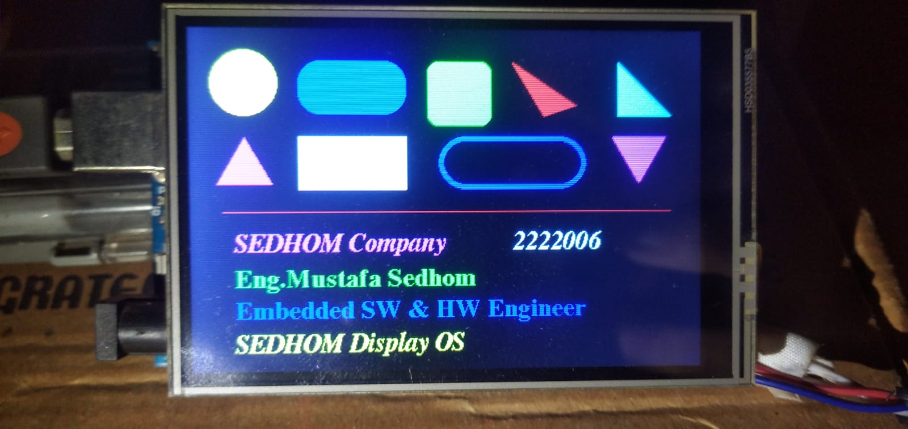
 # 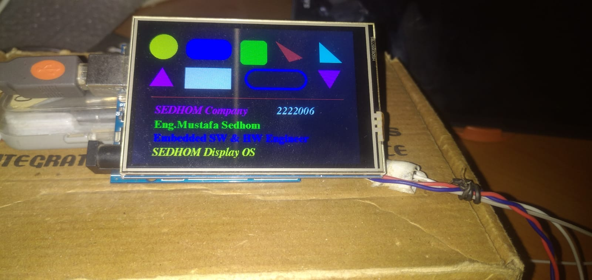
 # 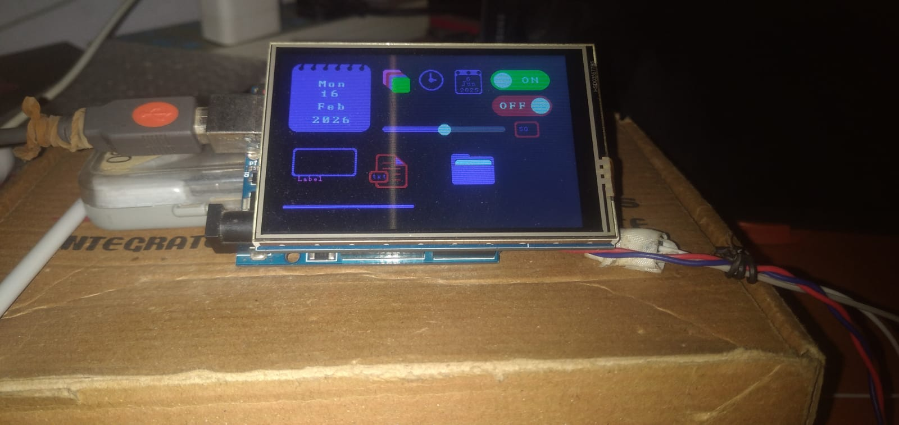
 # 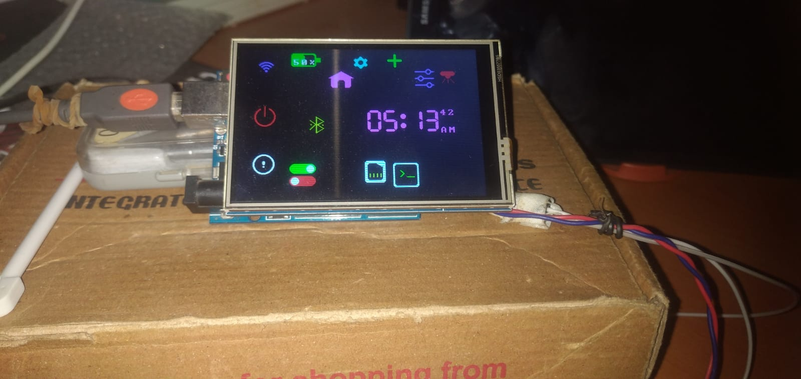
 # 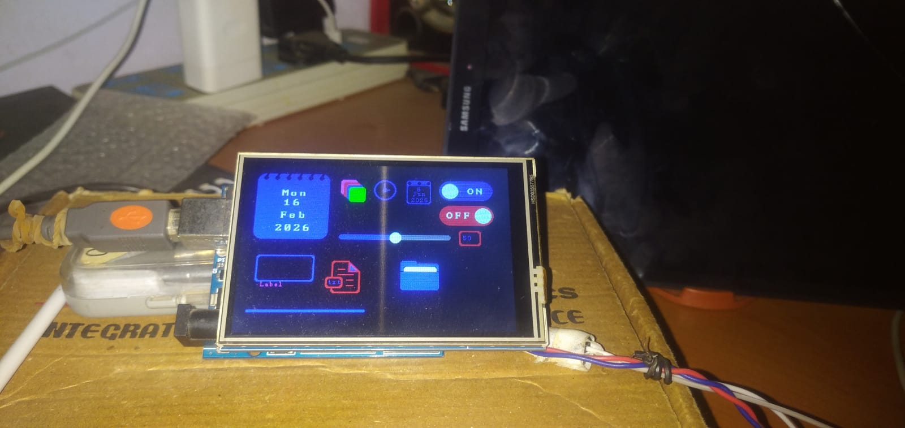
 # 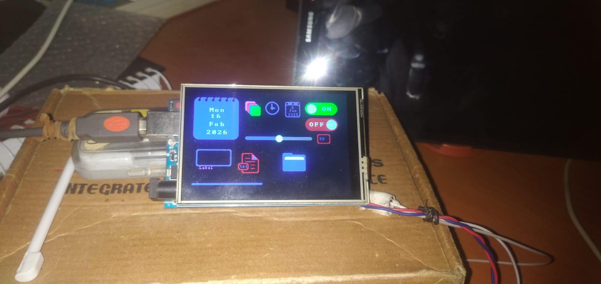
 # 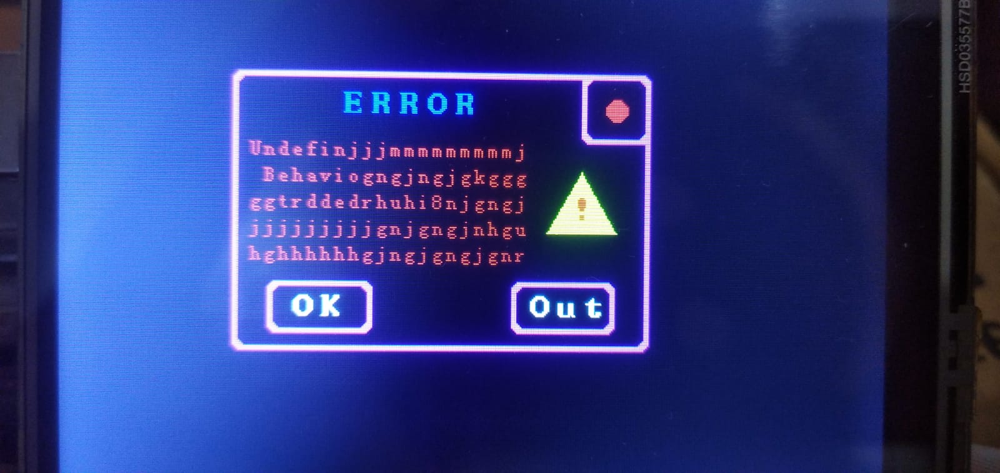
 # 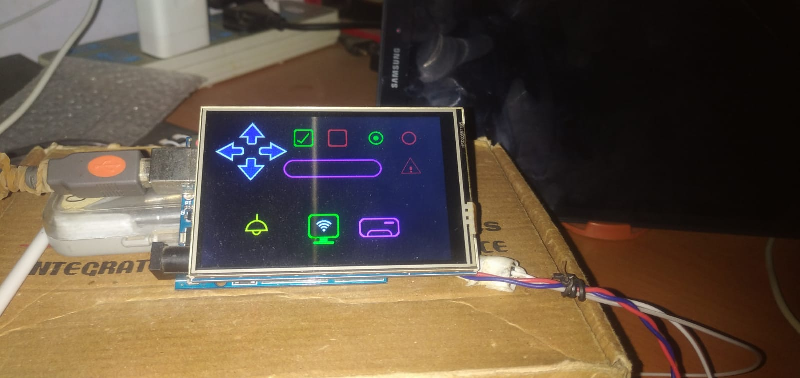
 # 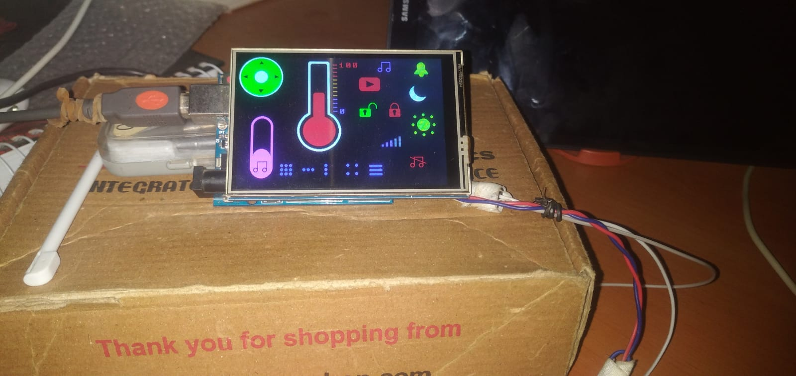
 # 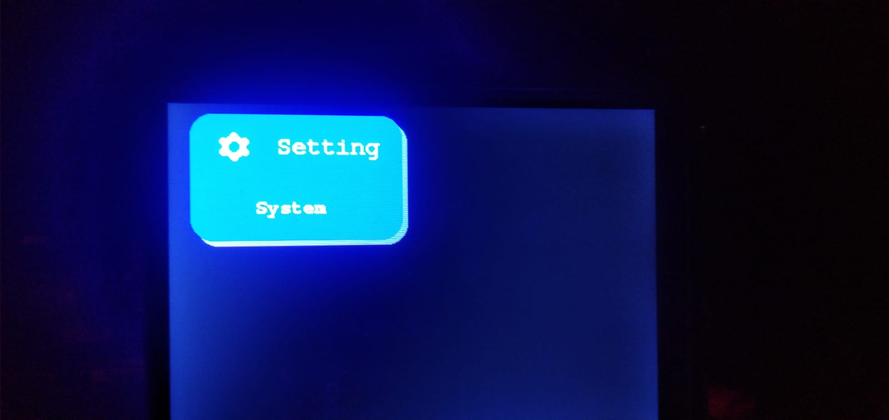
 # 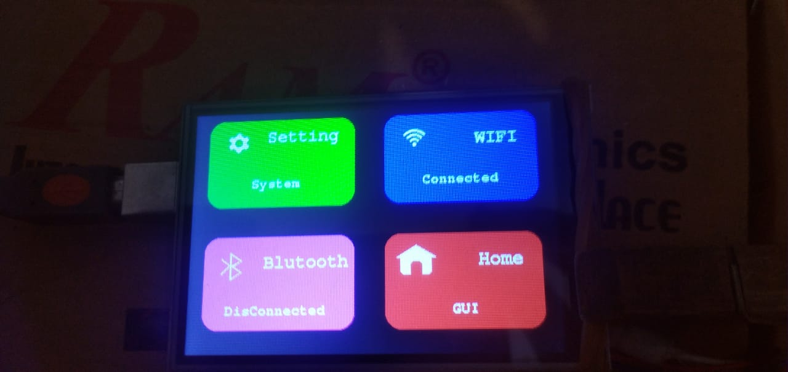
 # 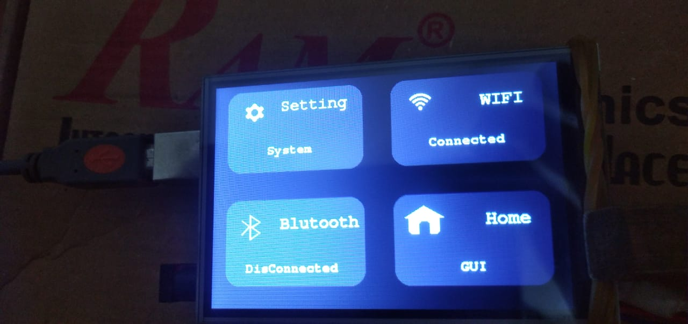
 # 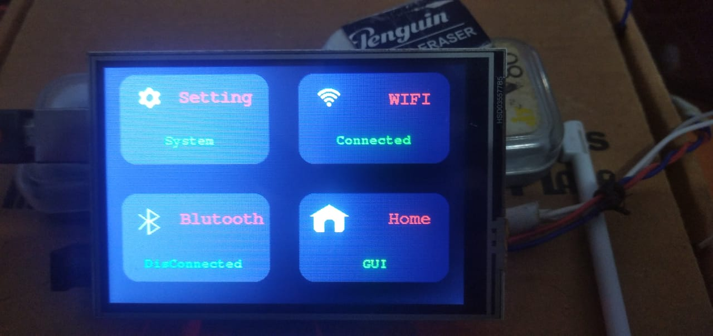
 # 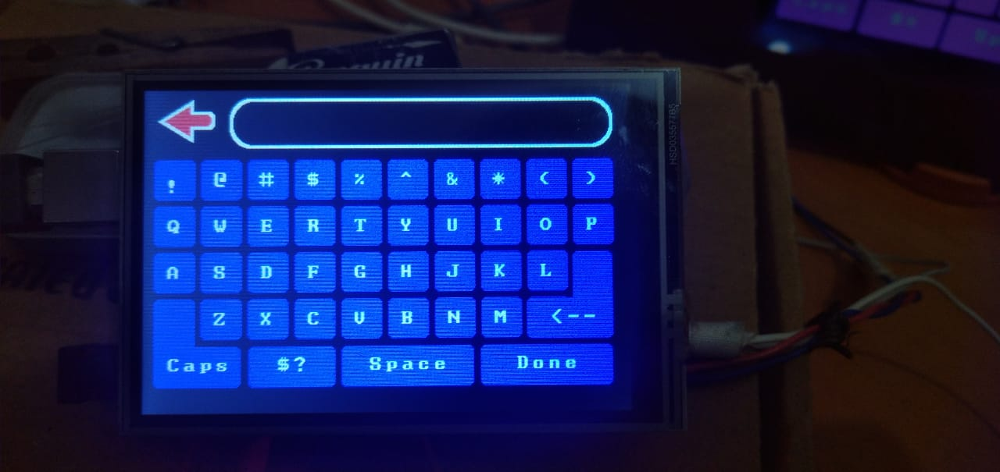
 # 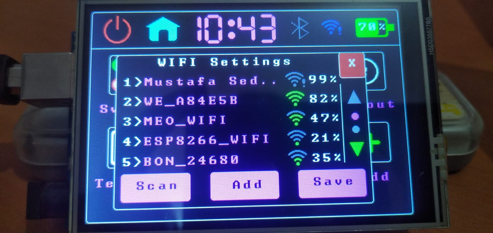
#

## if you want install it in arduino ide 
1. download this folder in your pc
2. put this folder in (~/Documentos/Arduino/libraries) between your arduino libraries .
3. you should install some library becuose this lib is a top layer of drivers 
    - MCUFreind_kbv  <- or choose any driver do you want and adding some setting in SEDHOM_Display_Settings.h file .
    - Adarfruit Touch <- this lib for touch you can use it and edit all setting touch in SEDHOM_Display_Settings.h file .
    - Adafruit GFX <- for drawing basic shapes .
    - QRCodeGFX <- for drawing QRCode icon .
    - SD <- for use sd card and load images and fonts in tft screen .
    - SPI <- this lib embbedded in arduino ide .
4. open arduino ide or restart arduino ide and open (file -> Examples -> SEDHOM_Display_OS -> ... ) choose any project and added any thing you want and use lib .
5. you can open new project and put in top first thing this line #include<SEDHOM_Display_OS.h> and next line SEDHOM_Display_OS   OS; and in setup OS.Init_Screen(Rotate_90_Degree,Night_Mode); and use OS. and show all proertes in this lib and see last pargraf in this to show all prpertes .
#
## else if you want install it in platform io -->

1. download this folder in your pc
2. create platform project .
3. put this folder in (lib folder) between your libraries .
4. you should add some library because this lib is a top layer of drivers input all library in lib folder for you project next SEDHOM_Display_OS folder
    - MCUFreind_kbv  <- or choose any driver do you want and adding some setting in SEDHOM_Display_Settings.h file .
    - Adarfruit Touch <- this lib for touch you can use it and edit all setting touch in SEDHOM_Display_Settings.h file .
    - Adafruit GFX <- for drawing basic shapes .
    - SD <- for use sd card and load images and fonts in tft screen .
    - SPI <- this lib for communication protocal betwwen MCU and SD card .
5. open (SEDHOM_Display_OS ->example-> ... ) choose any project and added any thing you want and use lib .
6. you can open new project and put in top first thing this line #include<SEDHOM_Display_OS.h> and next line SEDHOM_Display_OS   OS; and in setup OS.Init_Screen(Rotate_90_Degree,Night_Mode); and use OS. and show all propirtes in this lib and see last pargraf in this to show all prpertes .
#
## else if you Embedded Engineer and want use this library -->

- put this folder betwwen your project and adding this line #include<SEDHOM_Display_OS.h> and next line SEDHOM_Display_OS   OS; and in main before while loop OS.Init_Screen(Rotate_90_Degree,Night_Mode); and you can OS. to show all properites and in SEDHOM_Display_Setting.h all folders i use it and function yhis file is control all my library all files for drawing and gandling touch only .
#
