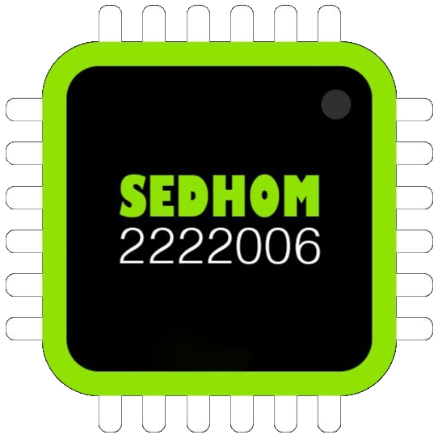

<div align="center">

# 🖥️ SEDHOM Display OS

### A lightweight C++ GUI framework for embedded TFT touch displays
 &emsp;

 &emsp;
 &emsp;

 &emsp;


**Build beautiful embedded GUIs using shapes, text, icons, widgets, touch and animations — without relying on bitmap icons for the GUI.**

<br>



<br><br>

[📦 Installation](#-installation) •
[🚀 Quick Start](#-quick-start) •
[🎨 Graphics](#-graphics) •
[🧩 Widgets](#-widgets) •
[👆 Touch](#-touch) •
[📚 API](#-api-overview) •
[📸 Projects](#-projects)

</div>

---

## ✨ What is SEDHOM Display OS?

**SEDHOM Display OS** is a C++ GUI library created for embedded systems and TFT touch displays.

The library provides a higher-level GUI layer for building:

- 🏠 Smart Home interfaces
- ⚙️ Machine control panels
- 📊 Sensor dashboards
- 🎛️ Embedded control interfaces
- 📱 Touch-based menus and pages
- 🖥️ Custom TFT user interfaces

The GUI is built primarily from **basic graphical primitives such as pixels, lines, rectangles, circles and triangles**, helping keep the interface lightweight instead of requiring a large collection of bitmap assets.

> **Designed with beginners in mind, while providing reusable components for embedded GUI development.**

---

## 🚀 Highlights

| Feature | SEDHOM Display OS |
|---|:---:|
| 🎨 Basic drawing primitives | ✅ |
| 🧩 Ready-made icons | ✅ |
| 🪟 GUI widgets | ✅ |
| 📄 Multi-page handling | ✅ |
| 👆 Touch handling | ✅ |
| 📝 Text & multiple fonts | ✅ |
| 💾 SD card support | ✅ |
| 🌈 RGB / RGB565 colors | ✅ |
| 🌫️ Blur & shadow effects | ✅ |
| 🎞️ Animations | ✅ |
| 📱 QR Code / Barcode | ✅ |
| 📡 Wi-Fi GUI components | ✅ |
| 🔵 Bluetooth GUI components | ✅ |
| 🌓 Light / Night modes | ✅ |
| 🔄 Display rotation | ✅ |
| 🧱 Custom shapes | ✅ |

---

## 💡 Why SEDHOM Display OS?

Instead of writing low-level display drawing code for every screen, SEDHOM Display OS gives you a reusable GUI layer.

```text
┌─────────────────────────────────────┐
│           Your Application          │
│                                     │
│   Smart Home • Machine • Sensors    │
└──────────────────┬──────────────────┘
                   │
                   ▼
┌─────────────────────────────────────┐
│         SEDHOM Display OS           │
│                                     │
│ Icons • Widgets • Pages • Touch     │
│ Shapes • Text • Effects • Animation │
└──────────────────┬──────────────────┘
                   │
                   ▼
┌─────────────────────────────────────┐
│       Graphics / Touch / SD         │
│        Driver Libraries             │
└──────────────────┬──────────────────┘
                   │
                   ▼
┌─────────────────────────────────────┐
│           TFT Display               │
└─────────────────────────────────────┘
```

This makes the application layer cleaner and lets you focus on the **behavior of your device**, rather than repeatedly implementing GUI primitives.

---

# 📦 Installation

## Arduino IDE

1. Download the library.
2. Copy the `SEDHOM_Display_OS` folder into:

```text
Documents/Arduino/libraries/
```

3. Install the required supporting libraries.
4. Restart Arduino IDE.
5. Open:

```text
File → Examples → SEDHOM_Display_OS
```

6. Choose an example and start building your interface.

### Dependencies

SEDHOM Display OS is a higher-level layer over display/graphics drivers. The current project documentation references:

- **MCUFRIEND_kbv** — display driver example; another compatible driver can be configured.
- **Adafruit Touch** — touch input.

> Driver and touch configuration are handled through `SEDHOM_Display_Settings.h`.

---

## PlatformIO

1. Create a PlatformIO project.
2. Put the `SEDHOM_Display_OS` library inside the project's `lib` directory.
3. Add the required supporting libraries.
4. Open the library examples.
5. Include the main header in your application:

```cpp
#include <SEDHOM_Display_OS.h>

SEDHOM_Display_OS GUI_OS;
SEDHOM_Icon_OS GUI_Icons(GUI_OS);
```

Then initialize the OS:

```cpp
void setup()
{
    GUI_OS.Init_OS();
}

void loop()
{
}
```

---

# 🚀 Quick Start

A minimal SEDHOM Display OS application can start with:

```cpp
#include <SEDHOM_Display_OS.h>

SEDHOM_Display_OS GUI_OS;
SEDHOM_Icon_OS GUI_Icons(GUI_OS);

void setup()
{
    GUI_OS.Init_OS();

    GUI_Icons.Text(
        {20, 40},
        FONT_BIG,
        Color_White,
        "Hello SEDHOM!"
    );

    GUI_Icons.Circle({
        {160, 120},
        40,
        Color_Blue,
        Shape_Fill
    });
}

void loop()
{
}
```

The exact structure of shape data depends on the corresponding `*_Data_t` types used by the library.

---

# 🎨 Graphics

SEDHOM Display OS includes basic primitives and higher-level shapes.

## Basic Shapes

```cpp
void Pixel(Pixel_Data_t pixel);
void Line(Line_Data_t line);    
void Rectangle(Rectangle_Data_t rect);
void Rotated_Rectangle(Rectangle_Data_t rect,int angle);
void Square(Square_Data_t sqrt);  
void Circle(Circle_Data_t circle); 
void Triangle(Triangle_Data_t tri); 
void Pie(Pie_Data_t pie);
void Ellipse(Ellipse_Data_t ellipse);
```

## Derived Shapes

```cpp
void Equilateral_Triangle(Triangle_special_Data_t tri);
void Right_Triangle(Icon_Data_t Icon,Area_t area,Shape_filled_t filled);
void Border_Rectangle(Icon_Data_t Border_Rect,Area_t area,int Radius,int Border_size);
void Container(Rectangle_Data_t container);
```

## 3D Graphics

```cpp
void Cube(Coordinate_t coordinate,int size,int Degree_angle_View,Color_t color);
```

## Images & Codes

```cpp
// Images
void Image_Single_Color(Image_Data_t image);
void Image_RGB(Image_RGB_Data_t image);
// Codes
void QRCode(QRCode_Data_t qr);
void BarCode(BarCode_Data_t qr);
```

---

# 🧩 Icons

The library includes reusable icons for common embedded GUI elements.

### Connectivity

```cpp
WIFI_Icon(...);
Bluetooth_Icon(...);
Signal_Icon(...);
```

### System

```cpp
Home_Icon(...);
Setting_Icon(...);
Power_off_Icon(...);
SD_Card_Icon(...);
Control_Icon(...);
Sensor_Icon(...);
About_Icon(...);
```

### UI Controls

```cpp
Button_Icon(...);
Switch_Icon(...);
Check_Box_Icon(...);
Radio_Button_Icon(...);
Text_Feild_Icon(...);
Plus_Icon(...);
Add_Icon(...);
X_Icon(...);
```

### Information

```cpp
Display_Time_Icon(...);
Display_Date_Icon(...);
Temperature_Meter_Icon(...);
Sound_value_Icon(...);
Battery_Icon(...);
ID_Card_Icon(...);
```

### Smart Home

```cpp
Smart_TV_Icon(...);
Air_Conditioner_Icon(...);
Chandelier_Icon(...);
Joy_Stick_Icon(...);
```

The icon system is parameterized using structures such as `Icon_Data_t`, allowing position, colors and other properties to be passed to the icon functions.

---

# 🪟 Widgets

SEDHOM Display OS provides reusable GUI widgets for building complete interfaces.

## Application Bar

```cpp
APP_Bar_Widget(...);
```

Includes configurable elements such as:

- Back arrow
- Wi-Fi status
- Bluetooth status
- Battery value
- Time
- Colors
- Background

## Drawer

```cpp
Drawer_Widget(...);
Handle_Drawer_Widget(...);
Delete_Drawer_Widget();
```

## Error Message

```cpp
ERROR_Massage_Widget(...);
```

## Frames

```cpp
Big_frame_widget(...);
```

---

# 🪟 Windows

Window components can be used to build structured interfaces.

```cpp
Start_new_Window(...);

ListView_Window(...);

Color_Setting_Window(...);

WIFI_ListView_Window(...);
```

This makes it easier to organize settings screens, lists and configuration pages.

---

# 👆 Touch

Touch handling is built into the library API.

```cpp
if (Touch.Is_Pressed())
{
    int x = Touch.get_X_point();
    int y = Touch.get_Y_point();
}
```

You can also define touch areas:

```cpp
if (Touch.onTap(touch_space))
{
    // Do
}
```

Available touch functions include:

```cpp
Is_Pressed();

get_X_point();
get_Y_point();
get_Z_point();

onTap(pressed_space);
onTap(pressed_space, Do_Function);
```

---

# 📄 Page Handling

SEDHOM Display OS provides page navigation functions:

```cpp
Handle_all_pages(pages_array, size);

goto_page(number);

push_page();

pop_page();
```

This allows you to structure an embedded application as multiple GUI pages instead of placing everything inside one large `loop()`.

---

# 📝 Text & Fonts

Text can be drawn using different data types and fonts.

```cpp
Text(coordinate, font, color, String);
Text(coordinate, font, color, float_value);
Text(coordinate, font, color, int_value);
Text(coordinate, text_data);
```

For long text:

```cpp
Text_OverFlow(
    coordinate,
    font,
    color,
    text,
    max_characters,
    "..."
);
```

## Included Font Families

### Default

```text
FONT_SMALL
FONT_BIG
FONT_SEVENSEGMENT
```

### FreeSans

```text
FONT_FREESANS_SMALL
FONT_FREESANS_MEDIUM
FONT_FREESANS_BIG
FONT_FREESANS_VERYBIG
```

### FreeSansBold

```text
FONT_FREESANSBOLD_SMALL
FONT_FREESANSBOLD_MEDIUM
FONT_FREESANSBOLD_BIG
FONT_FREESANSBOLD_VERYBIG
```

### FreeSansOblique

```text
FONT_FREESANSOBLIQUE_SMALL
FONT_FREESANSOBLIQUE_MEDIUM
FONT_FREESANSOBLIQUE_BIG
FONT_FREESANSOBLIQUE_VERYBIG
```

### FreeSerif

```text
FONT_FREESERIF_SMALL
FONT_FREESERIF_MEDIUM
FONT_FREESERIF_BIG
FONT_FREESERIF_VERYBIG
```

Additional **Bold**, **Italic**, **Mono**, **MonoBold**, **MonoOblique** and **MonoBoldOblique** variants are available in the library.

---

# 🎨 Colors

SEDHOM Display OS supports RGB/RGB565-oriented color handling.

## Set Colors

```cpp
Set_Color(Color_RGB_t color);

Set_Color(uint16_t Hex_code);

Set_Color(String Html_Hex_color_code);
```

Convert RGB to grayscale:

```cpp
RGB_to_Gray(rgb_color);
```

## Built-in Colors

```text
Color_Black
Color_Navy
Color_DarkGary
Color_DarkCyan
Color_Maroon
Color_Purple
Color_Olive
Color_LightGrey
Color_DarkGrey
Color_Blue
Color_Green
Color_Cyan
Color_Red
Color_Magenta
Color_Yellow
Color_White
Color_Orange
Color_GreenYellow
Color_Pink
```

---

# 🟦 Effects

Visual effects are available for GUI elements.

```cpp
Blur_Effect(...);

Color_Blur_Effect(...);

Shadow_Effect(...);
```

These effects can be applied to supported shapes and GUI areas.

---

# 🎞️ Animation

The library includes animation functions for text and shapes.

## Text Animation

```cpp
Change_Text_Color(...);

Scrolling_Text(...);

Text_change_color(...);
```

## Shape Animation

```cpp
Rotate_Rectangle_Animation(...);

Rotate_Cube_Animation(...);
```

---

# 🎛️ Controls

Button behavior can be connected to a state variable and callback.

```cpp
Button_Control(
    &state,
    button_off,
    button_on,
    onTap
);
```

Both rectangle and circle button shapes are supported.

---

# ⏱️ Time Utilities

Time conversion:

```cpp
Convert_Time(
    value,
    Time_Unit,
    Return_Unit
);
```

Delay:

```cpp
Wait(time, unit);
```

Stop display:

```cpp
Stop_Display(time, unit);
```

Current time:

```cpp
Now_Time(Time_Unit_Millis_Second);
```

This can be useful when implementing non-blocking-style timing logic around GUI updates.

---

# 🧱 SEDHOM Data Types

The library defines a collection of reusable types for GUI development.

## Core Types

```text
Dynamic
lambda()
Image_t
string_t
word_t
byte_t
Color_t
```

## System & Status

```text
ROTATION_STATUS_t
WIFI_STATUS_t
BLUETOOTH_STATUS_t
SWITCH_STATUS_t
SIGNAL_STATUS_t
```

## Time & Date

```text
User_ID_Data_t
Time_Data_t
Date_Data_t
Time_Unit_t
Days_t
Months_t
Hijri_Months_t
```

## Connectivity

```text
WIFI_Encryption_Type_t
WIFI_Data_t
WIFI_Data_Simple_t
```

## Graphics

```text
Position_t
Shapes_type_t
Coordinate_t
Shapes_t
Area_t
Color_RGB_t
Shape_filled_t
Visibility_t
Direction_t
Orientation_t
Icon_Size_t
```

## Text & Icons

```text
Icon_Data_t
Text_Data_t
Text_C_Data_t
```

## Shapes

```text
Square_Data_t
Rectangle_Data_t
Circle_Data_t
Triangle_Data_t
Triangle_special_Data_t
Line_Data_t
Pixel_Data_t
Ellipse_Data_t
```

## Images & Codes

```text
Image_Data_t
Image_RGB_Data_t
QRCode_Data_t
BarCode_Data_t
Barcode_Type_t
```

## Touch & Controls

```text
Touch_Data_t
Touch_State_t
Button_Data_t
```

---

# 🖥️ OS Core API

The main OS control functions include:

```cpp
Init_OS(
    ROTATION_STATUS_t Rotate = Rotate_90_Degree,
    Color_t Mode = Night_Mode
);

Restart_OS();

Set_Device_Mode(Night_Mode);

Screen_Height();
Screen_Width();

Mode();
Not_Mode();

Fill_Screen(Color_Black);
```

Display rotation options:

```text
Rotate_0_Degree
Rotate_90_Degree
Rotate_180_Degree
Rotate_270_Degree
```

Display modes:

```text
Night_Mode
Light_Mode
```

---

# 📊 Data Structures

The library also exposes common data-structure concepts used by the project:

```cpp
Stack<Data_Type> stack;

Queue<Data_Type> queue;

LinkedList<Data_Type> linkedlist;
```

---

# 📸 Projects

The library has been used with embedded projects involving **Arduino boards and TFT displays**, including a **3.5-inch TFT shield**.

Project photos are available in the repository's `images` folder.

<div align="center">


</div>

### More Photos & Videos

[📂 View SEDHOM Display OS Photos & Videos on Google Drive](https://drive.google.com/drive/folders/1wHmT84Y8fNRLakDVIZ7PI9R9al82iIt8?usp=sharing)

---

# 👨‍💻 Author

<div align="center">

### Eng.Mustafa Sedhom

**Embedded Software & Hardware Engineer**</br>
**Flutter Developer**

📧 `elmohandes24680@gmail.com`

🔗 [LinkedIn](https://www.linkedin.com/in/mustafa-sedhom-bb2551322)

🔗 [Facebook](https://www.facebook.com/share/1AHF9akrtB/)

📱 WhatsApp: `+201144962908`

</div>

---

# 🗺️ Library Structure

```text
Your Embedded Application
          │
          ▼
┌───────────────────────────┐
│     SEDHOM Display OS     │
├───────────────────────────┤
│ OS Core                   │
│ Shapes                    │
│ Icons                     │
│ Text & Fonts              │
│ Widgets                   │
│ Windows                   │
│ Touch                     │
│ Pages                     │
│ Effects                   │
│ Animation                 │
│ Controls                  │
│ Time Utilities            │
└─────────────┬─────────────┘
              │
              ▼
┌───────────────────────────┐
│ Supporting Libraries      │
│                           │
│ Display Driver            │
│ Touch                     │
└─────────────┬─────────────┘
              │
              ▼
        TFT / Touch Display
```

---

# ⭐ Why use it?

**SEDHOM Display OS turns low-level TFT drawing into reusable GUI components.**

Instead of repeatedly implementing:

```text
Pixel → Shape → Icon → Widget → Page → Touch
```

you can build on a reusable API:

```cpp
WIFI_Icon(...);
APP_Bar_Widget(...);
Start_new_Window(...);
Button_Control(...);
goto_page(...);
```

That is the main idea behind the library:

> **Build the GUI once. Reuse it across embedded projects.**

---

<div align="center">

## ⭐ SEDHOM Display OS

**Lightweight • Modular • Touch • GUI • Embedded**

Made with ❤️ for Embedded Systems

**Version 5.5.5**

</div>
